# Beat Music Player - Class Diagram

## Mermaid Code

```mermaid
classDiagram
    %% Activities
    class MainActivity {
        -int userId
        -FrameLayout miniPlayerContainer
        +onCreate()
        +navigateToFragment(Fragment)
        +showMiniPlayer()
    }
    
    class LoginActivity {
        +onCreate()
        +validateLogin()
    }
    
    class SignUpActivity {
        +onCreate()
        +registerUser()
    }
    
    class PlayerActivityWithService {
        -MusicServiceConnection musicServiceConnection
        -ShapeableImageView albumArtImageView
        -TextView trackTitleTextView
        -SeekBar seekBar
        +onCreate()
        +onServiceConnected()
        +onTrackChanged()
    }
    
    class LocalMusicPlayerActivity {
        -MediaPlayer mediaPlayer
        -List~LocalSong~ playlist
        -int currentSongIndex
        +onCreate()
        +playPause()
        +nextSong()
        +previousSong()
    }
    
    class ArtistSongsActivity {
        -RecyclerView songsRecyclerView
        -SongAdapter songAdapter
        +onCreate()
        +loadArtistSongs()
    }
    
    %% Fragments
    class HomeFragment {
        -RecyclerView artistsRecyclerView
        -RecyclerView tracksRecyclerView
        -TrackAdapter trackAdapter
        -SearchView searchView
        +onCreateView()
        +searchTracks()
    }
    
    class LocalSongsFragment {
        -RecyclerView songsRecyclerView
        -SongAdapter songAdapter
        -ProgressBar progressBar
        +onCreateView()
        +loadSongs()
        +refreshSongs()
    }
    
    class AlbumFragment {
        -RecyclerView albumsRecyclerView
        -AlbumAdapter albumAdapter
        -List~AlbumWithSongs~ allAlbums
        +onCreateView()
        +loadAlbums()
        +filterAlbums()
    }
    
    class ArtistFragment {
        -RecyclerView artistsRecyclerView
        -ArtistAdapter artistAdapter
        +onCreateView()
        +loadArtists()
    }
    
    class PlaylistFragment {
        -RecyclerView playlistsRecyclerView
        -PlaylistAdapter playlistAdapter
        +onCreateView()
        +loadPlaylists()
        +createPlaylist()
    }
    
    class AlbumSongsFragment {
        -RecyclerView songsRecyclerView
        -SongAdapter songAdapter
        +onCreateView()
        +loadAlbumSongs()
    }
    
    class ArtistSongsFragment {
        -RecyclerView songsRecyclerView
        -SongAdapter songAdapter
        +onCreateView()
        +loadArtistSongs()
    }
    
    class PlaylistSongsFragment {
        -RecyclerView songsRecyclerView
        -SimpleSongAdapter songAdapter
        +onCreateView()
        +loadPlaylistSongs()
    }
    
    %% Adapters
    class SongAdapter {
        -List~LocalSong~ songs
        -OnSongClickListener listener
        +onCreateViewHolder()
        +onBindViewHolder()
        +updateSongs()
    }
    
    class AlbumAdapter {
        -List~AlbumWithSongs~ albums
        -OnAlbumClickListener listener
        +onCreateViewHolder()
        +onBindViewHolder()
        +updateAlbums()
    }
    
    class ArtistAdapter {
        -List~ArtistWithSongs~ artists
        -OnArtistClickListener listener
        +onCreateViewHolder()
        +onBindViewHolder()
        +updateArtists()
    }
    
    class PlaylistAdapter {
        -List~PlaylistWithSongs~ playlists
        -OnPlaylistClickListener listener
        +onCreateViewHolder()
        +onBindViewHolder()
        +updatePlaylists()
    }
    
    class SimpleSongAdapter {
        -List~LocalSong~ songs
        +onCreateViewHolder()
        +onBindViewHolder()
    }
    
    class ArtistWithSongsAdapter {
        -List~ArtistWithSongs~ artists
        +onCreateViewHolder()
        +onBindViewHolder()
    }
    
    %% Data Entities
    class User {
        +int userId
        +String email
        +String password
        +String firstName
        +String lastName
    }
    
    class LocalSong {
        +int songId
        +String title
        +String filePath
        +int userId
        +int artistId
        +int albumId
        +String albumArtUri
        +long duration
        +long size
    }
    
    class Artist {
        +int artistId
        +String name
    }
    
    class Album {
        +int albumId
        +String name
        +int artistId
        +String releaseYear
    }
    
    class Playlist {
        +int playlistId
        +String name
        +int userId
        +String description
        +Date createdAt
    }
    
    class PlaylistSong {
        +int id
        +int playlistId
        +int songId
        +int position
    }
    
    class LocalVideo {
        +int videoId
        +String title
        +String filePath
        +int userId
    }
    
    %% Relationship Entities
    class AlbumWithSongs {
        +Album album
        +List~LocalSong~ songs
    }
    
    class ArtistWithSongs {
        +Artist artist
        +List~LocalSong~ songs
    }
    
    class PlaylistWithSongs {
        +Playlist playlist
        +List~LocalSong~ songs
    }
    
    class UserWithPlaylists {
        +User user
        +List~Playlist~ playlists
    }
    
    %% DAOs
    class MusicDao {
        +insertSong(LocalSong)
        +insertArtist(Artist)
        +insertAlbum(Album)
        +getSongsForUser(int)
        +getAlbumsForUser(int)
        +getArtistsForUser(int)
        +deleteSong(LocalSong)
        +deleteAlbum(Album)
        +deleteArtist(Artist)
    }
    
    class PlaylistDao {
        +insertPlaylist(Playlist)
        +insertPlaylistSong(PlaylistSong)
        +getPlaylistsForUser(int)
        +getPlaylistWithSongs(int)
        +deletePlaylist(Playlist)
        +removeFromPlaylist(int, int)
    }
    
    %% Database
    class AppDatabase {
        +getInstance(Context)
        +musicDao()
        +playlistDao()
    }
    
    %% ViewModels
    class MainViewModel {
        -MusicDao musicDao
        -ExecutorService executor
        +scanMusic()
        +getSongs()
    }
    
    class LocalMusicViewModel {
        -MusicDao musicDao
        -PlaylistDao playlistDao
        -ExecutorService executor
        +getSongs()
        +getPlaylists()
        +addToPlaylist()
    }
    
    %% Services
    class MusicService {
        -MediaPlayer mediaPlayer
        -List~LocalSong~ playlist
        -int currentIndex
        +play()
        +pause()
        +next()
        +previous()
        +setPlaylist()
    }
    
    class MusicServiceConnection {
        -ServiceConnection serviceConnection
        +bindService()
        +unbindService()
    }
    
    class PlaylistManager {
        -List~LocalSong~ currentPlaylist
        +setPlaylist()
        +addSong()
        +removeSong()
        +shuffle()
    }
    
    %% Utilities
    class MediaStoreScanner {
        -Context context
        -MusicDao musicDao
        -int userId
        +scanMusicFiles()
        +getOrCreateArtist()
        +getOrCreateAlbum()
    }
    
    class PermissionManager {
        +hasStoragePermissions()
        +requestStoragePermissions()
    }
    
    class MiniPlayerManager {
        -static MiniPlayerManager instance
        +getInstance()
        +showMiniPlayer()
        +hideMiniPlayer()
    }

    %% Relationships
    MainActivity --> HomeFragment
    MainActivity --> LocalSongsFragment
    MainActivity --> AlbumFragment
    MainActivity --> ArtistFragment
    MainActivity --> PlaylistFragment
    MainActivity --> MediaStoreScanner
    MainActivity --> PermissionManager
    MainActivity --> MiniPlayerManager

    LocalSongsFragment --> SongAdapter
    AlbumFragment --> AlbumAdapter
    ArtistFragment --> ArtistAdapter
    PlaylistFragment --> PlaylistAdapter
    AlbumSongsFragment --> SongAdapter
    ArtistSongsFragment --> SongAdapter
    PlaylistSongsFragment --> SimpleSongAdapter

    SongAdapter --> LocalSong
    AlbumAdapter --> AlbumWithSongs
    ArtistAdapter --> ArtistWithSongs
    PlaylistAdapter --> PlaylistWithSongs

    PlayerActivityWithService --> MusicServiceConnection
    PlayerActivityWithService --> MusicService
    LocalMusicPlayerActivity --> LocalSong

    AppDatabase --> MusicDao
    AppDatabase --> PlaylistDao
    AppDatabase --> User
    AppDatabase --> LocalSong
    AppDatabase --> Artist
    AppDatabase --> Album
    AppDatabase --> Playlist
    AppDatabase --> PlaylistSong
    AppDatabase --> LocalVideo

    MusicDao --> LocalSong
    MusicDao --> Artist
    MusicDao --> Album
    PlaylistDao --> Playlist
    PlaylistDao --> PlaylistSong

    AlbumWithSongs --> Album
    AlbumWithSongs --> LocalSong
    ArtistWithSongs --> Artist
    ArtistWithSongs --> LocalSong
    PlaylistWithSongs --> Playlist
    PlaylistWithSongs --> LocalSong
    UserWithPlaylists --> User
    UserWithPlaylists --> Playlist

    MainViewModel --> MusicDao
    LocalMusicViewModel --> MusicDao
    LocalMusicViewModel --> PlaylistDao

    MediaStoreScanner --> MusicDao
    MediaStoreScanner --> Artist
    MediaStoreScanner --> Album
    MediaStoreScanner --> LocalSong

    MusicService --> LocalSong
    MusicServiceConnection --> MusicService
    PlaylistManager --> LocalSong

    LocalSong --> Artist
    LocalSong --> Album
    Album --> Artist
    PlaylistSong --> Playlist
    PlaylistSong --> LocalSong
    Playlist --> User
```



## How to Use This File

### 1. **GitHub/GitLab Documentation**
- This file is already in Markdown format with Mermaid syntax
- GitHub and GitLab will automatically render the diagram
- Perfect for README.md or documentation folders

### 2. **Mermaid Live Editor**
- Go to [mermaid.live](https://mermaid.live)
- Copy the code between the ```mermaid``` tags
- Export as PNG, SVG, or PDF

### 3. **VS Code with Mermaid Extension**
- Install "Mermaid Preview" extension
- Open this file and use preview mode
- Export or screenshot the rendered diagram

### 4. **Documentation Tools**
- **Notion**: Supports Mermaid diagrams
- **Confluence**: Has Mermaid plugins
- **Obsidian**: Native Mermaid support
- **Typora**: Built-in Mermaid rendering

### 5. **Convert to Other Formats**
- Use online converters to transform to:
  - PlantUML
  - Draw.io format
  - Lucidchart
  - Visio

## Architecture Overview

This diagram represents a **MVVM (Model-View-ViewModel)** architecture with:
- **Room Database** for local storage
- **Service-based** music playback
- **Fragment-based** navigation
- **Adapter pattern** for RecyclerViews
- **Repository pattern** through DAOs
